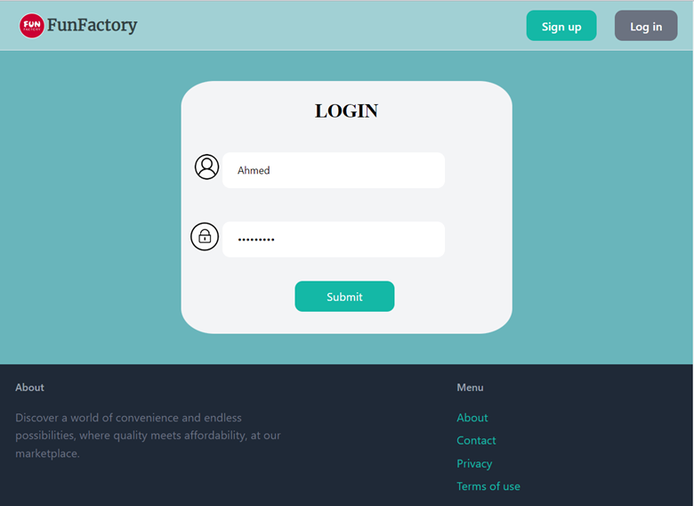
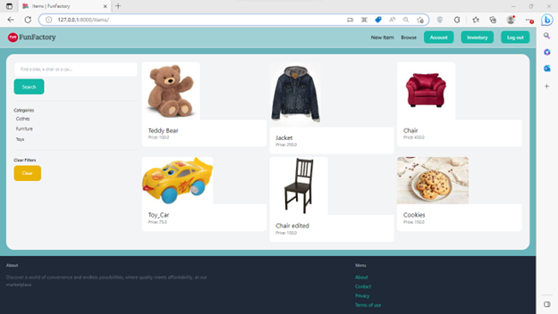

# Marketplace (Django-Python)
This is a project for the parallel and distributed system course where we make an online market place in which users can add, edit and delete items for other users to buy 

## Login
 *FunFactory*

## Products
 *FunFactory*

## Installation on Windows
1. Clone this project
2. install python virtual environment 
```
pip install virtualenv
```
3. create new virtual environment
```
python -m venv venv
```
4. activate the new virtual
```
.\venv\Scripts\activate
```
5. install django localy in venv
```
pip install django 
```
6. install pillow package
```
pip install pillow
```
7. install django rest frame work
```
pip install djangorestframework
```
8. Download SQL Server Management 
9. Create Two Database with names MarketDB1 , MarketDB2 on two different servers  
10. make migrations 
```
python manage.py makemigrations
```
11. apply migrations
```
python manage.py migrate
```
12. run server
```
python manage.py runserver
```
